# PromptForge Backend Architecture Diagrams

## 1. System Context

CURRENT STATE: local operator writes in Obsidian, the backend ingests to Postgres, n8n orchestrates workflows, and delivery targets and LLM providers are external. GAPS: no real auth and no live-session transport. FUTURE STATE: hardened provider routing and broader delivery targets.

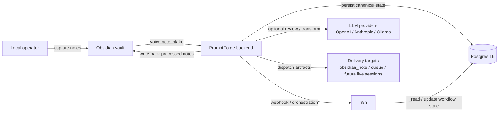

## 2. Container / Service Architecture

CURRENT STATE: two Python runtimes inside Docker Compose, one for the watcher and one for the API/services, both backed by Postgres and the mounted vault. GAPS: no production auth boundary and no separate cache or broker. FUTURE STATE: support services can be added without breaking the monolith-first split.

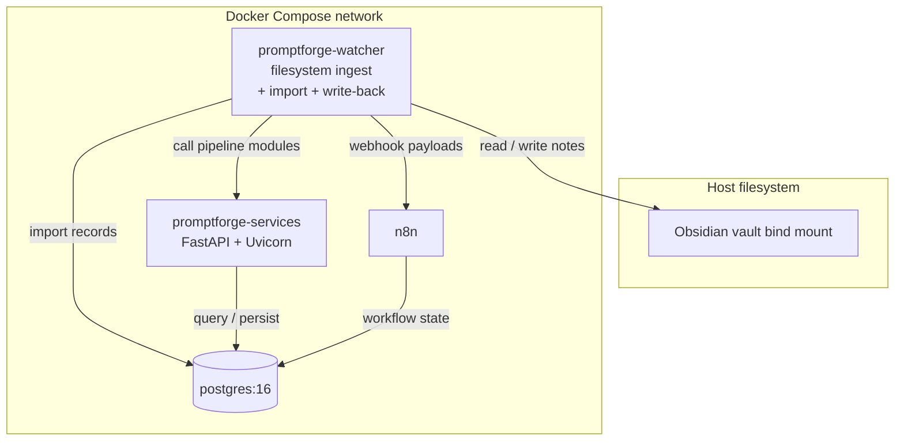

## 3. Component Diagram

CURRENT STATE: the watcher owns filesystem import and write-back, while the Python service owns parsing, preprocessing, validation, rendering, delivery dispatch, console mutations, and partial LLM routing. GAPS: live session adapters are not wired end to end. FUTURE STATE: the same modules can absorb more provider adapters without changing the architecture split.

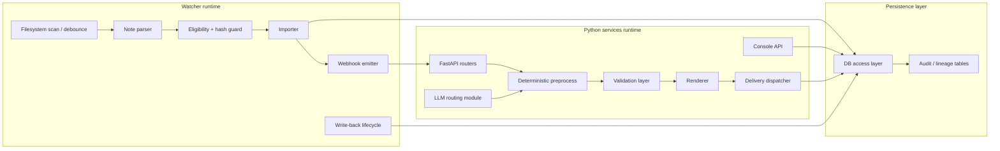

## 4.1 Intake Flow

CURRENT STATE: the watcher reads a new voice note, parses it, deduplicates it, and writes canonical intake rows to Postgres. GAPS: malformed notes stay in error and are not silently repaired. FUTURE STATE: reimport policy can become more explicit without changing lineage.

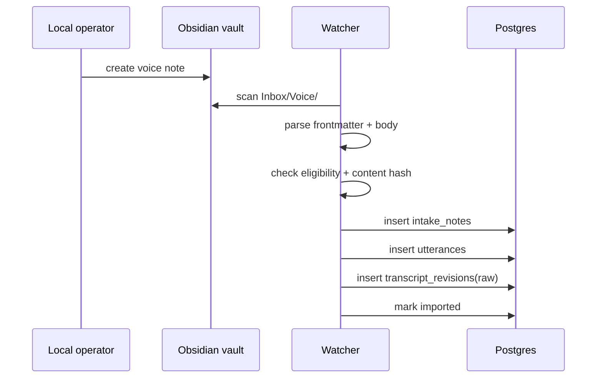

## 4.2 Processing Pipeline

CURRENT STATE: preprocessing, validation, and rendering are deterministic gates before any delivery is created. GAPS: LLM output is still partial wiring, so malformed structured output must fail before render. FUTURE STATE: additional deterministic transforms can be added without changing the stage order.

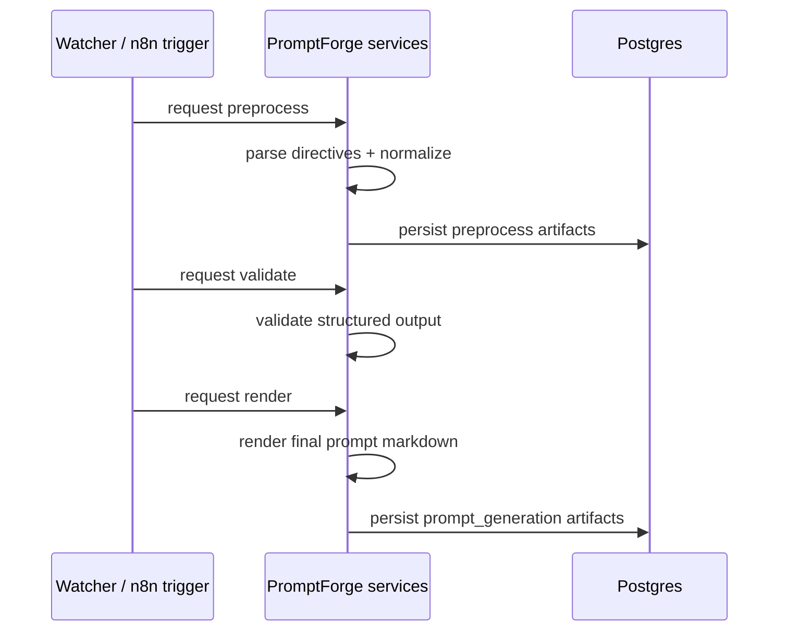

## 4.3 Delivery Flow

CURRENT STATE: a rendered prompt becomes a delivery row, then the dispatcher sends it to an allowed target. GAPS: live `chat_session`, `claude_session`, and `codex_session` transports are unsupported. FUTURE STATE: additional adapters can attach without merging delivery with prompt generation.

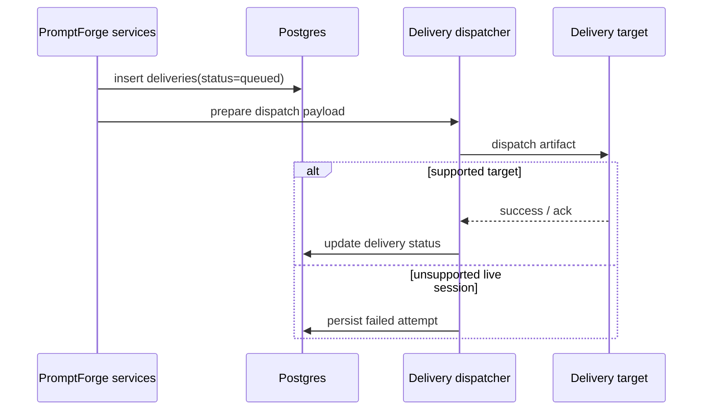

## 4.4 Failure + Retry Flow

CURRENT STATE: failures are retained in Postgres and the source note stays in the vault when processing or delivery fails. GAPS: retrying is append-only, not in-place mutation, so operators must not expect a failed row to become a success row. FUTURE STATE: richer reroute automation can sit on the same immutable attempt history.

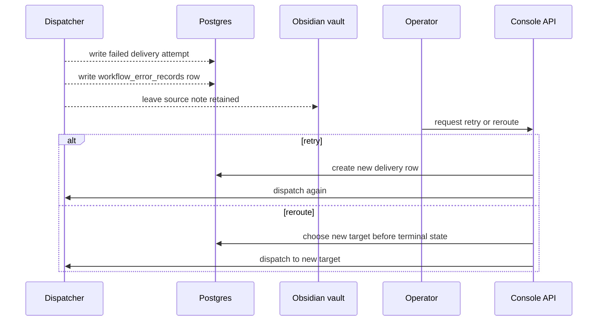

## 4.5 Write-back Flow

CURRENT STATE: successful processing writes a processed artifact back into the vault and updates note state in Postgres. GAPS: failed runs do not generate processed write-back artifacts. FUTURE STATE: write-back templates can evolve without changing the canonical record model.

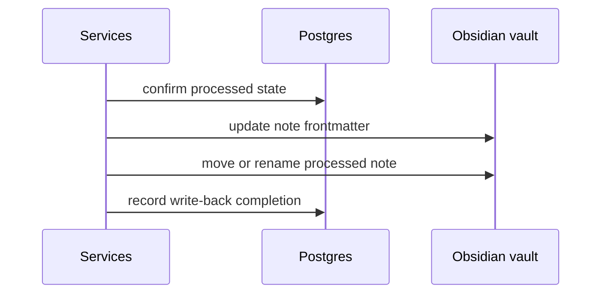

## 4.6 n8n Webhook Flow

CURRENT STATE: the watcher emits webhook payloads and n8n continues the orchestration path. GAPS: workflow sequencing is externalized, but canonical state still lives in Postgres. FUTURE STATE: the same webhook contract can feed more recovery and queue workflows.

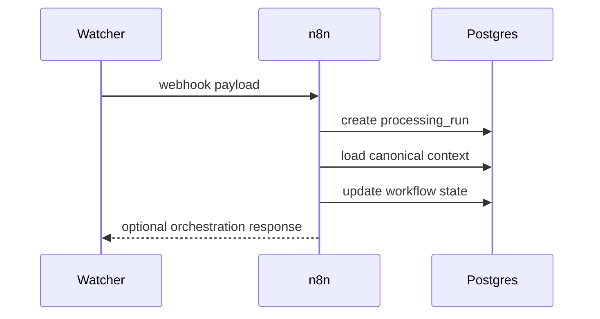

## 5. Deployment Diagram

CURRENT STATE: the stack is a local Docker Compose deployment with bind-mounted vault access and named volumes for durable service data. GAPS: no cloud deployment or external broker is assumed. FUTURE STATE: the same shape can be promoted to a hardened self-hosted install.

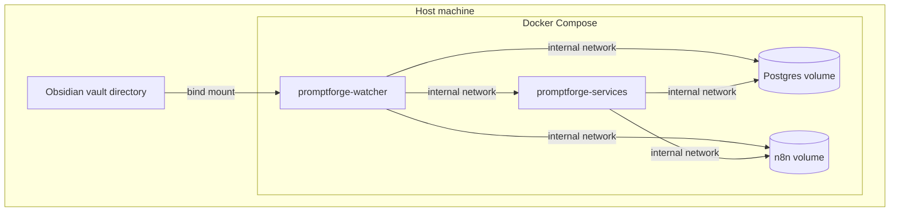

## 6. ERD / Data Model

CURRENT STATE: the relational model keeps intake, prompt generation, delivery, rules, templates, dictionary terms, and audit rows separate. GAPS: LLM runs and workflow errors are append-only observability records, not application state substitutes. FUTURE STATE: more providers and targets can attach through the same FK structure.

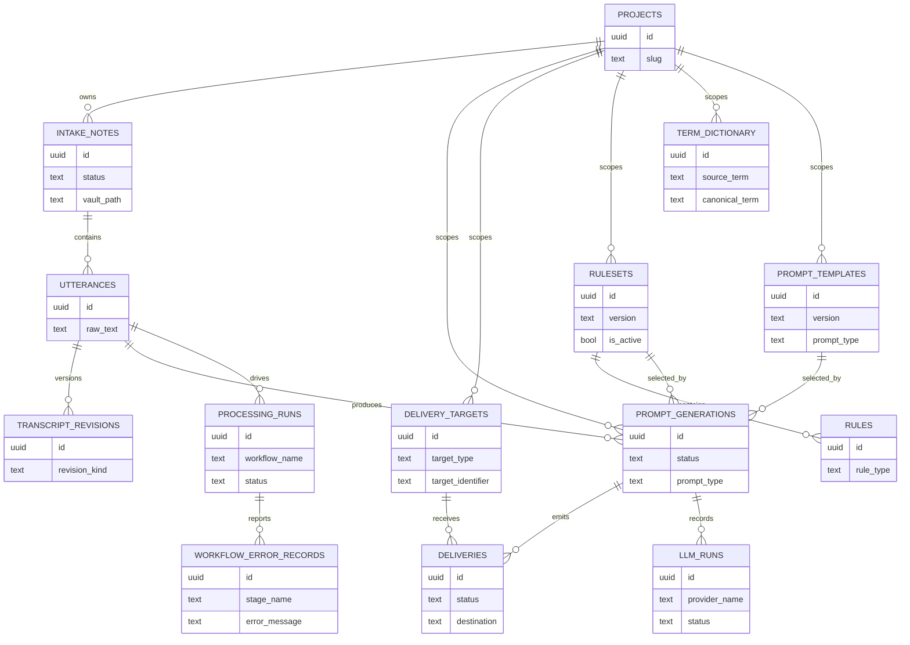

## 7.1 Intake Note Lifecycle

CURRENT STATE: intake notes move from new to imported to processing to processed, with error and archived as terminal outcomes. GAPS: reimport is policy-driven and must not overwrite lineage. FUTURE STATE: reset/reimport can be explicit without breaking append-only history.

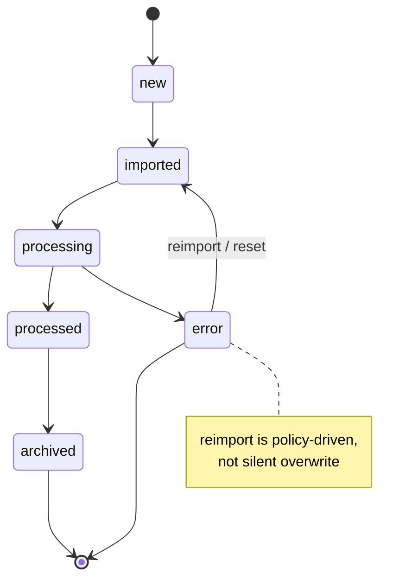

## 7.2 Prompt Generation Lifecycle

CURRENT STATE: prompt generation is deterministic-first and ends in rendered or failed. GAPS: failed generation is terminal unless an operator explicitly reruns it. FUTURE STATE: reset/retry can be added as an explicit control-path without mutating history.

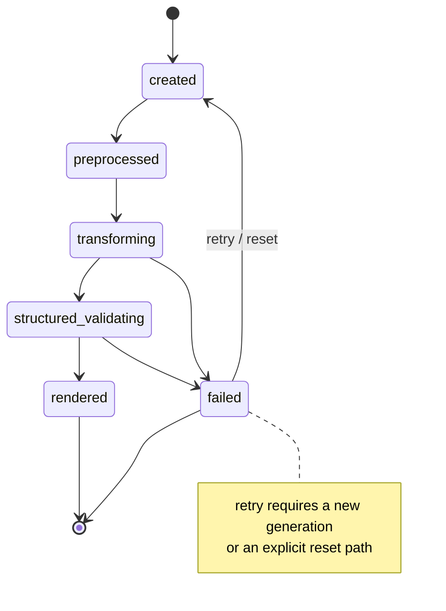

## 7.3 Delivery Lifecycle

CURRENT STATE: deliveries are append-only attempts with queued, dispatching, delivered, acked, and failed states. GAPS: retry creates a new row, and reroute is only valid before terminal states. FUTURE STATE: more transport adapters can share the same immutable attempt history.

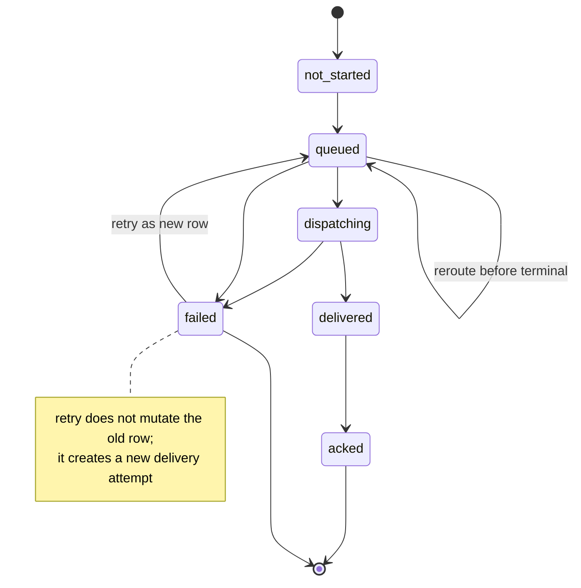

## 8. Trust Boundary / Security

CURRENT STATE: the filesystem, API, database, and external provider boundaries are explicit, but production auth is missing and header hints are only operational metadata. GAPS: there is no real auth boundary and no hard trust layer for multi-user access. FUTURE STATE: a real auth boundary can be inserted without changing Postgres as source of truth.

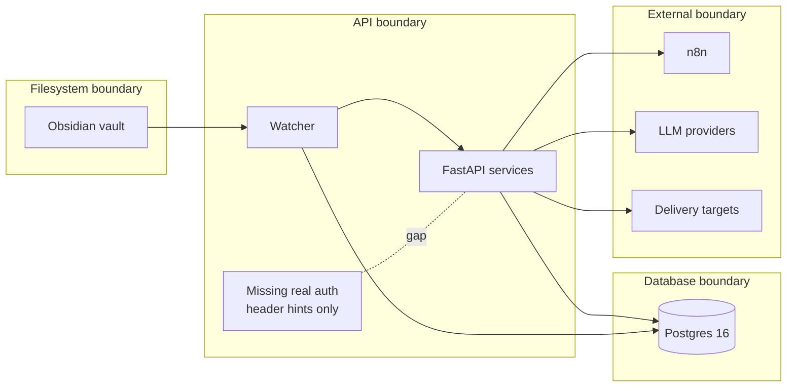

## 9. Gap Analysis

CURRENT STATE: the system is strong on deterministic ingestion, append-only lineage, and Postgres-backed state. GAPS: auth, observability, caching, robust queueing, live session transport, and multi-user support are intentionally missing. FUTURE STATE: those capabilities can be added as support-plane services without collapsing the core architecture.

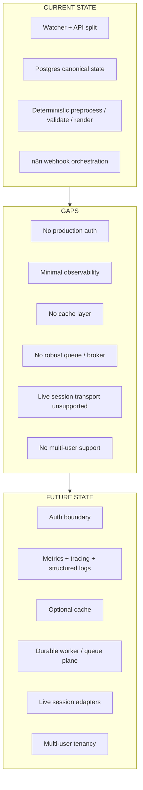

## 10. Future-State Architecture

CURRENT STATE: the core remains a local-first monolith with Postgres as source of truth and deterministic stages first. GAPS: production concerns are not yet present. FUTURE STATE: a hardened self-hosted deployment adds auth, observability, queueing, and richer transport adapters without changing the core rules.

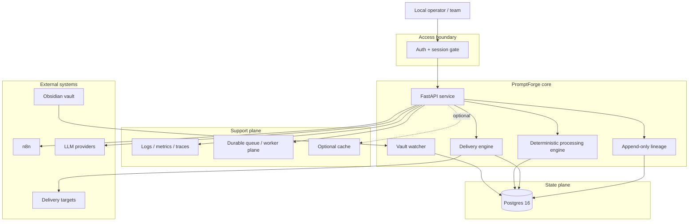
