# PromptForge Cross-System Architecture

## Modeling Assumptions
- Directly grounded: Obsidian vault intake, watcher-driven ingestion, backend-owned deterministic processing, Postgres as canonical store, console as operator control plane, optional n8n webhook orchestration, optional LLM usage, and delivery dispatch are all evidenced by `/lump/apps/prompt-forge/README.md`, `/lump/apps/prompt-forge/API_COMPAT.md`, `/lump/apps/prompt-forge/docs/planning/promptforge_backend_architecture_diagrams.md`, watcher/services code, and this repo's console architecture and API client.
- Minimally inferred: "PromptForge watcher" is modeled as the combined watcher runtime plus its repository/writeback/webhook responsibilities; "backend services" is modeled as the FastAPI plus deterministic pipeline plus console API plus dispatch layer because the code currently groups those concerns in one Python service runtime.
- Future-only: hardened auth/authz, stronger operator separation, richer observability, more complete delivery transports, and multi-user support are proposed only. They do not exist as current-state guarantees.

## 1. End-to-End System Context Diagram

**CURRENT STATE**

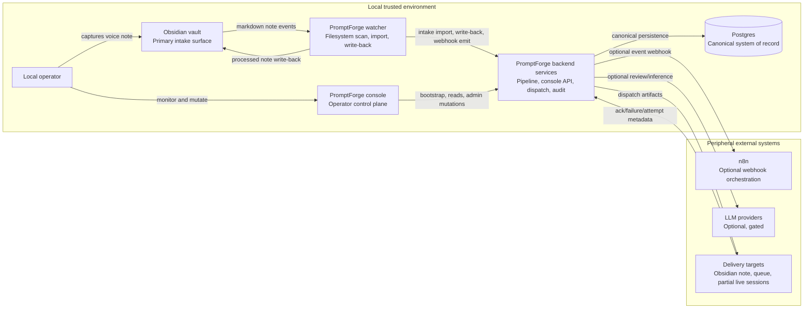

**GAPS**
- The system is still locally trusted and single-user by assumption; the console and API are not hardened for broader exposure.
- Live delivery targets exist in the domain model, but some transports remain partial or explicitly unsupported.
- n8n participates in orchestration but the exact ownership boundary is still evolving.

**FUTURE STATE**
- Keep backend and Postgres as central authority while hardening auth, observability, and delivery transport adapters.
- Preserve Obsidian as intake and console as control plane even as the stack grows.

**What this shows**
- Intake originates in the filesystem, not in the UI.
- Backend and Postgres are central; console, n8n, LLMs, and delivery endpoints are supporting systems around that core.

## 2. Layered Architecture Diagram

**CURRENT STATE**

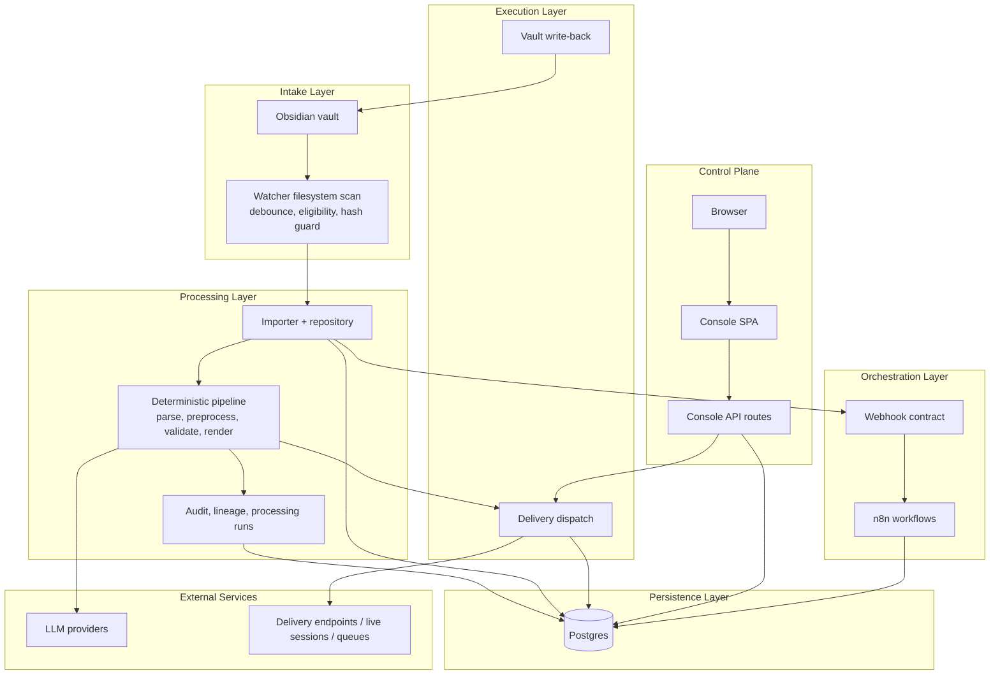

**GAPS**
- The processing and control-plane concerns still live inside one backend codebase and mostly one service runtime.
- No cache or broker layer exists between control plane, processing, and persistence.
- n8n and write-back are supportive layers, but the code-level separation is still practical rather than strongly isolated.

**FUTURE STATE**
- Stronger service boundaries can emerge without changing layer ownership: intake remains intake, processing remains authoritative, control plane remains observational/mutational, orchestration remains optional.

**What this shows**
- Persistence is authoritative, processing drives core behavior, and the console sits beside that path rather than in it.

## 3. Control Flow Diagram

**CURRENT STATE**

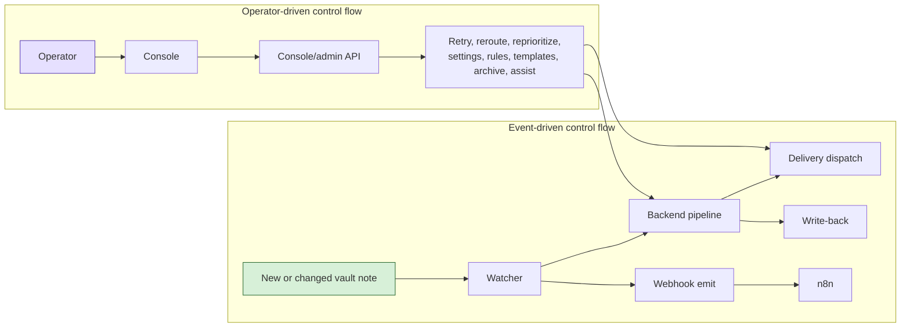

**GAPS**
- Operator mutations can trigger state transitions, but they do not replace the watcher- and pipeline-driven baseline control path.
- n8n currently reacts to backend-emitted events; it should not be misread as the primary driver.

**FUTURE STATE**
- Make operator-triggered actions more explicit as controlled interventions over canonical backend state.
- Keep event-driven ingestion primary even if more operator tools are added.

**What this shows**
- Filesystem events initiate the main pipeline.
- The console only initiates administrative interventions.

## 4. Data Flow & Lineage Diagram

**CURRENT STATE**

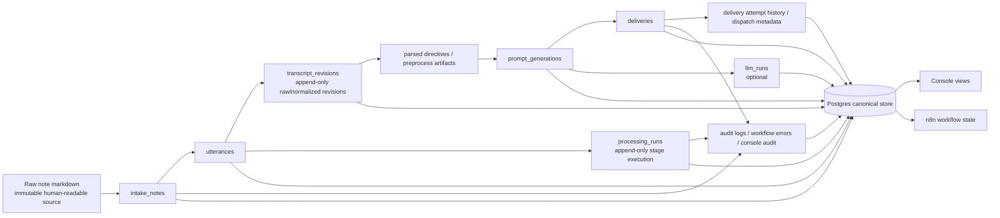

**GAPS**
- The append-only story is partly distributed across multiple tables and logs rather than one dedicated lineage service.
- n8n can read and react to persisted state, but it must not become shadow state ownership.
- The console currently reconstructs lineage from backend read surfaces rather than from a dedicated lineage graph.

**FUTURE STATE**
- A clearer lineage projection can sit on top of the same canonical rows without changing ownership.

**What this shows**
- Raw text stays immutable at the source.
- Postgres-backed records, not UI state or n8n memory, define the lineage chain.

## 5. End-to-End Sequence Diagrams

### 5.1 Full Happy Path

**CURRENT STATE**

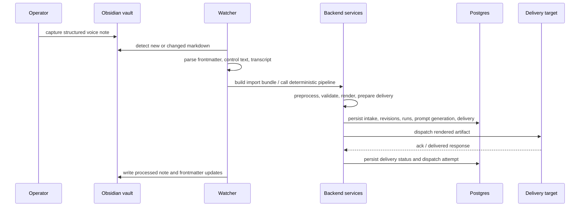

**GAPS**
- Some target types still fail explicitly instead of completing the happy path.
- Write-back and dispatch success are coupled operationally today even though their state is separately recorded.

**FUTURE STATE**
- More delivery adapters can slot into the same happy path without changing ownership.

**What this shows**
- The full path starts from vault intake and ends in persisted delivery/write-back artifacts.

### 5.2 Failure Path

**CURRENT STATE**

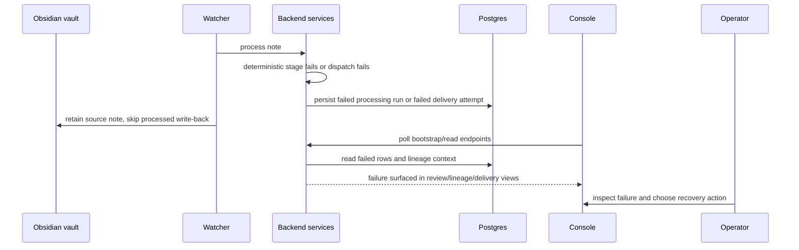

**GAPS**
- Failure visibility is present, but observability depth and operator diagnostics are still limited compared with the underlying state kept in Postgres.

**FUTURE STATE**
- Stronger recovery surfaces can remain append-only and still expose richer diagnostics.

**What this shows**
- Failures are retained, not hidden or overwritten.

### 5.3 Operator Intervention Path

**CURRENT STATE**

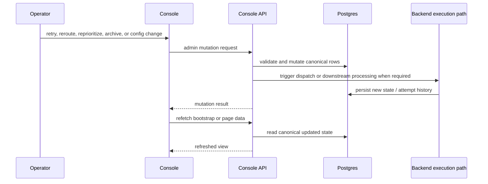

**GAPS**
- Current role/actor handling is minimal header-based signaling, not hardened authorization.
- Some operator actions still depend on partial backend capability.

**FUTURE STATE**
- Hardened auth and audit can preserve the same control path while making it safe for broader use.

**What this shows**
- Operator actions always travel through backend-owned transitions.

### 5.4 n8n Orchestration Path

**CURRENT STATE**

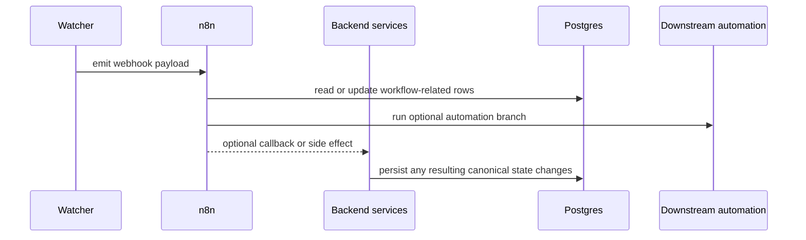

**GAPS**
- The boundary between backend-native orchestration and n8n-managed workflow steps is still pragmatic, not fully formalized.
- n8n persistence can become confusing if read as authoritative rather than supportive.

**FUTURE STATE**
- Keep n8n strictly reactive to backend events with clearer contracts and bounded side effects.

**What this shows**
- n8n is a reacting orchestrator, not the system of record.

### 5.5 LLM-Assisted Path

**CURRENT STATE**

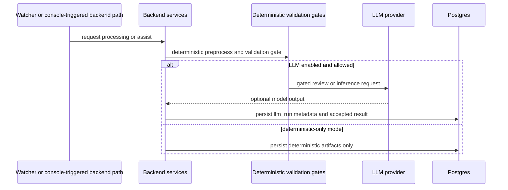

**GAPS**
- Provider support is partial today; OpenAI and Anthropic remain incomplete in current wiring.
- LLM usage is optional but the console needs to continue presenting it as such.

**FUTURE STATE**
- More provider adapters and stricter acceptance policies can fit into the same gated model.

**What this shows**
- LLM calls are optional branches behind backend-controlled gates.

## 6. State Ownership Diagram

**CURRENT STATE**

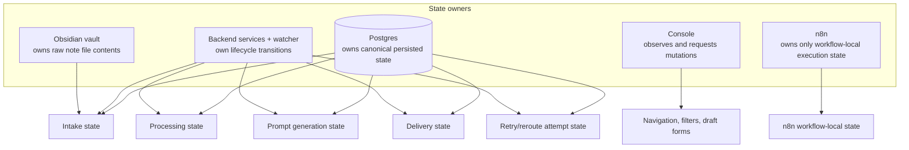

**GAPS**
- Watcher and backend services are logically distinct owners of behavior but practically part of one backend authority today.
- The console can mutate state, but it does not own any lifecycle.

**FUTURE STATE**
- Stronger internal service boundaries can clarify execution ownership while keeping backend + Postgres authoritative.

**What this shows**
- Core lifecycle state belongs to the backend and is persisted in Postgres.
- The browser owns only temporary UI state.

## 7. Trust Boundary Diagram

**CURRENT STATE**

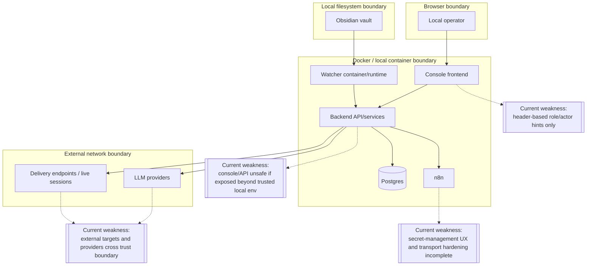

**GAPS**
- Real authN/authZ is absent.
- Secrets and privileged operations rely on local-trust assumptions.
- External providers and endpoints sit across the network boundary with partial hardening.

**FUTURE STATE**
- Add hardened auth, better secret handling, and tighter network exposure controls without changing core system ownership.

**What this shows**
- PromptForge is safe only under a local-trusted deployment assumption today.

## 8. Cross-System Gap Analysis Diagram

**CURRENT STATE**

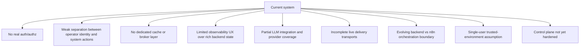

**GAPS**
- These are active architecture constraints, not edge cases.

**FUTURE STATE**
- Each gap can be addressed incrementally without changing the core local-first, Obsidian-first, Postgres-authoritative model.

**What this shows**
- The main architectural risks are around hardening and boundary clarity, not around the core domain model.

## 9. Current vs Future System Architecture

**CURRENT STATE**

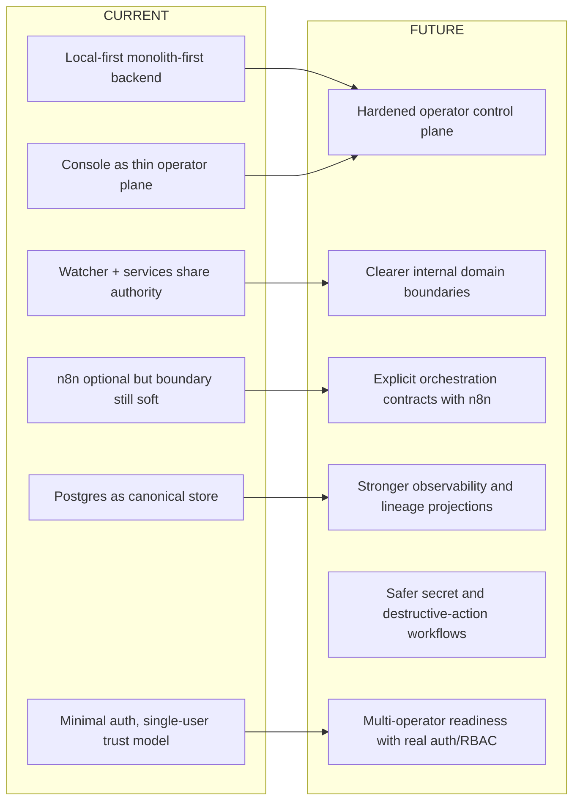

**GAPS**
- Current architecture is viable for a trusted MVP but not yet for broader operational exposure.

**FUTURE STATE**
- The evolution path is refinement and hardening, not a change in core ownership.

**What this shows**
- Future state should preserve the current domain truths while fixing boundary and hardening weaknesses.

## 10. Failure Domains & Isolation Diagram

**CURRENT STATE**

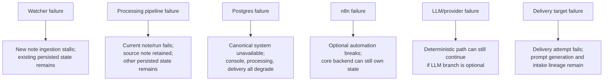

**GAPS**
- Recovery tooling exists, but isolation is mostly logical rather than enforced with separate infrastructure domains.
- Database failure remains the highest-blast-radius event because Postgres is the canonical store.

**FUTURE STATE**
- Stronger health checks, alerting, and replay/recovery flows can improve isolation without changing ownership.

**What this shows**
- Most external failures are recoverable without losing canonical lineage.
- Postgres is the critical dependency.

## 11. Operational Model Diagram

**CURRENT STATE**

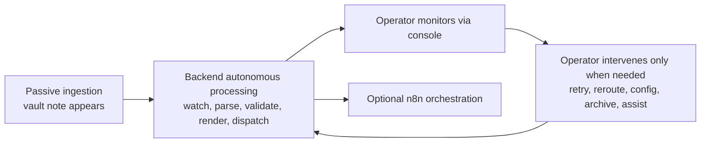

**GAPS**
- The operational model is correct, but the UI and auth model still need hardening to match the sensitivity of the actions exposed.

**FUTURE STATE**
- Keep the system autonomous by default, with operators acting as supervisors rather than request-by-request users.

**What this shows**
- PromptForge is not a request/response SaaS app.
- It is an autonomous local pipeline with an operator control plane layered beside it.
