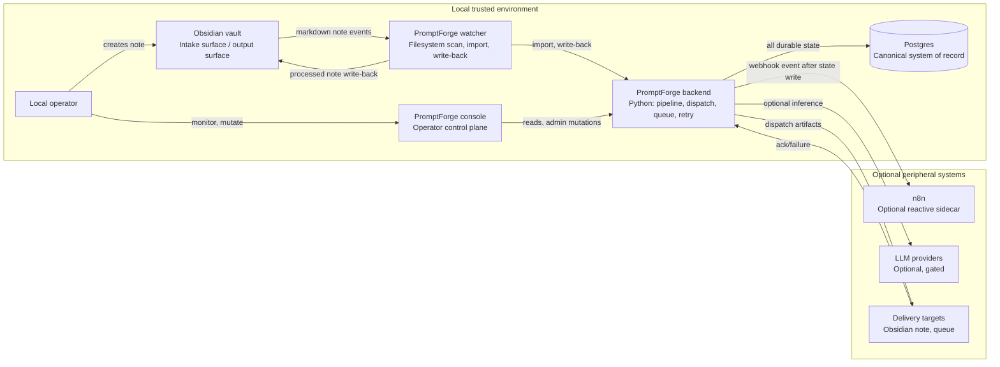
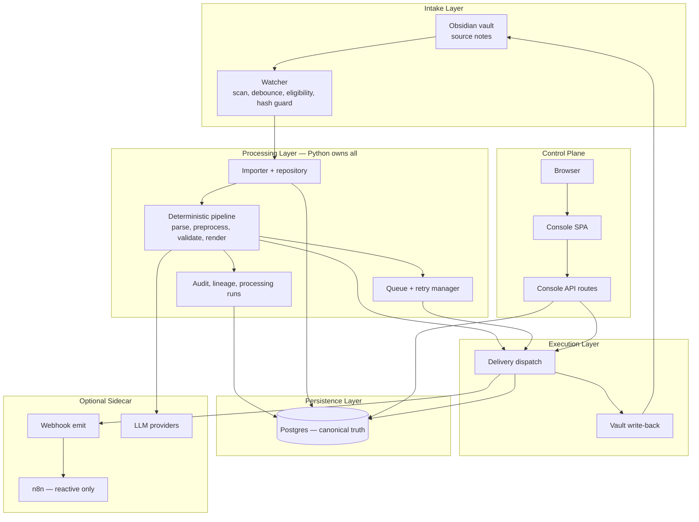
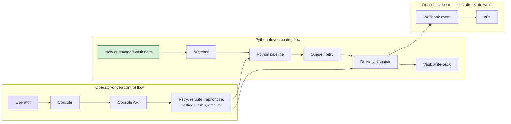
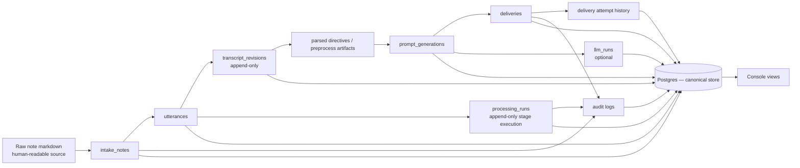
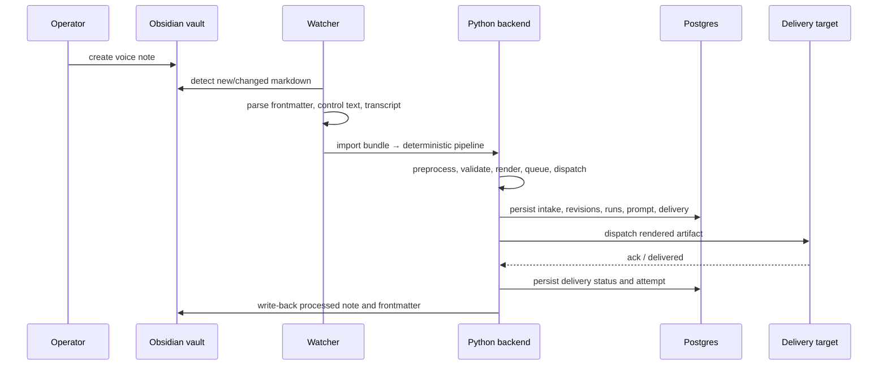
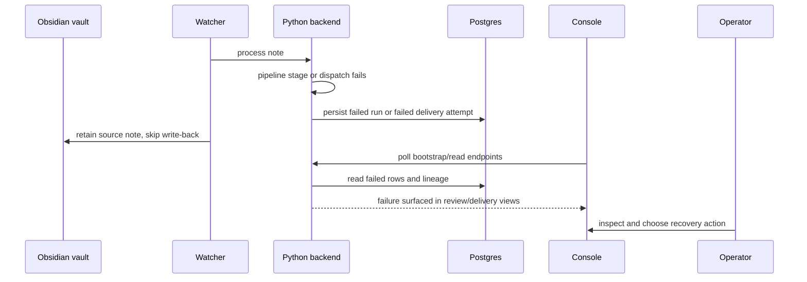
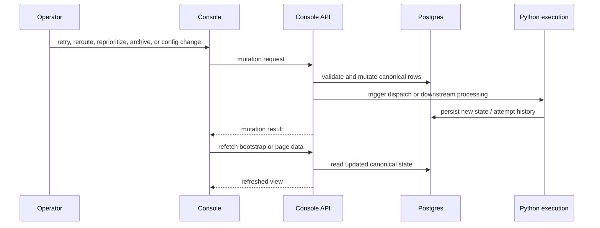
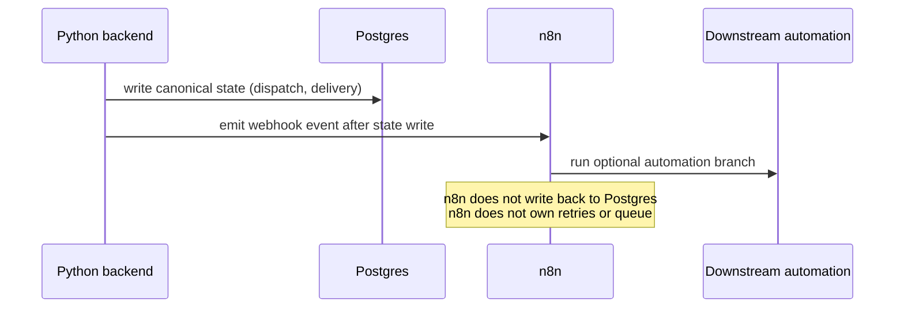
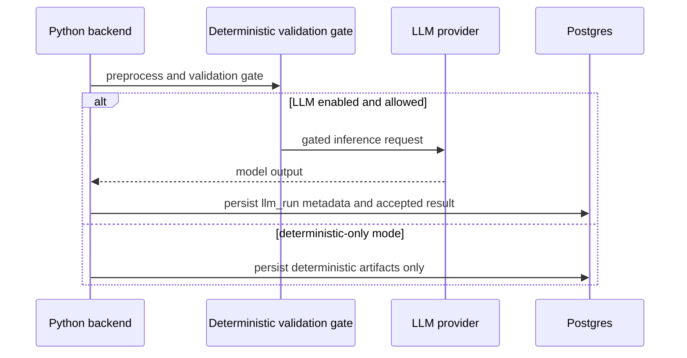

# PromptForge System Architecture

## Runtime Overview

PromptForge is a single-user, local-only Obsidian-to-prompt pipeline.

**Python owns all workflow.** Intake, parse, compile, queue, dispatch, and retry are all Python-owned. No external system drives these steps.

**Postgres is canonical truth.** All durable state — intake records, processing runs, prompt generations, delivery attempts, audit logs — lives in Postgres. Nothing else is authoritative.

**Obsidian vault is intake and output surface only.** Source notes arrive via the vault. Processed prompts are written back to the vault. The vault does not own state; Postgres does.

**n8n is an optional reactive sidecar.** Python may fire webhook events to n8n after state has been written to Postgres. n8n can react to those events (run automations, send notifications) but it does not own workflow, queue, retries, or canonical state.

**No auth/role model.** Single-user local deployment. No RBAC, no session auth.

**No live-session (tmux) delivery.** Removed in phase 2.

---

## 1. System Context

---

## 2. Layer Diagram

n8n sits outside the processing and persistence layers. It receives events after Python has already committed state.

---

## 3. Control Flow

Python drives the full path. n8n receives an event after dispatch writes state — it does not control any step in the pipeline.

---

## 4. Data Flow & Lineage

Postgres-backed records define the lineage chain. Vault files are the source for intake; after ingestion, Postgres owns state.

---

## 5. Sequence Diagrams

### 5.1 Happy Path

### 5.2 Failure Path

### 5.3 Operator Intervention

### 5.4 n8n Sidecar Path

n8n is notified after Python has finished. It cannot initiate or control pipeline steps.

### 5.5 LLM-Assisted Path

---

## 6. State Ownership

| State domain | Owner |
|---|---|
| Raw note file contents | Obsidian vault (input surface only) |
| Intake, processing, prompt, delivery lifecycle | Python backend |
| All durable canonical state | Postgres |
| Temporary UI state | Console browser |
| Optional automation reactions | n8n (does not own canonical state) |

---

## 7. Failure Domains

| Component failure | Impact |
|---|---|
| Watcher | New note ingestion stalls; existing persisted state intact |
| Processing pipeline | Current run fails; source note retained; other state intact |
| Postgres | Canonical system unavailable; console, processing, delivery all degrade |
| n8n | Optional automation breaks; Python backend continues normally |
| LLM provider | Deterministic path continues if LLM branch is optional |
| Delivery target | Delivery attempt fails; prompt generation and lineage remain |

Postgres is the highest-blast-radius failure. n8n failure has no effect on core pipeline.

---

## 8. Operational Model

PromptForge is not a request/response app. It is an autonomous local pipeline:

- Vault note appears → watcher detects → Python pipeline runs automatically
- Postgres records every stage
- Console lets the operator monitor and intervene (retry, reroute, config) when needed
- n8n may react to events fired by Python after state is committed

The operator is a supervisor, not a per-request user.
